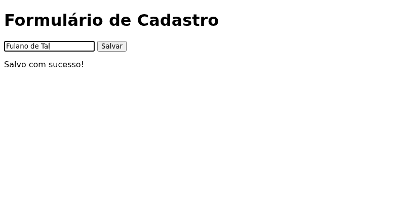

# Envio de formulário e IndexedDB

O primeiro passo do cenário consiste em acessar a página do formulário, preencher os dados do usuário e aguardar a mensagem de sucesso. Isso garante que os dados foram submetidos e salvos corretamente no IndexedDB.

```yaml
- navegar para: "formulario.html"
- enviar formulário:
    nome: "Fulano de Tal"
- esperar aparecer: "Salvo com sucesso"
```


<!-- d58622db523176c9 -->

Após a inserção, o teste verifica a leitura dos dados. Para isso, navegamos para a página de exibição e aguardamos a conclusão do carregamento para confirmar que os dados do IndexedDB foram renderizados com sucesso na tela.

```yaml
- navegar para: "exibicao.html"
- esperar sumir: "Carregando"
```


<!-- 6df26ce68441e84a -->